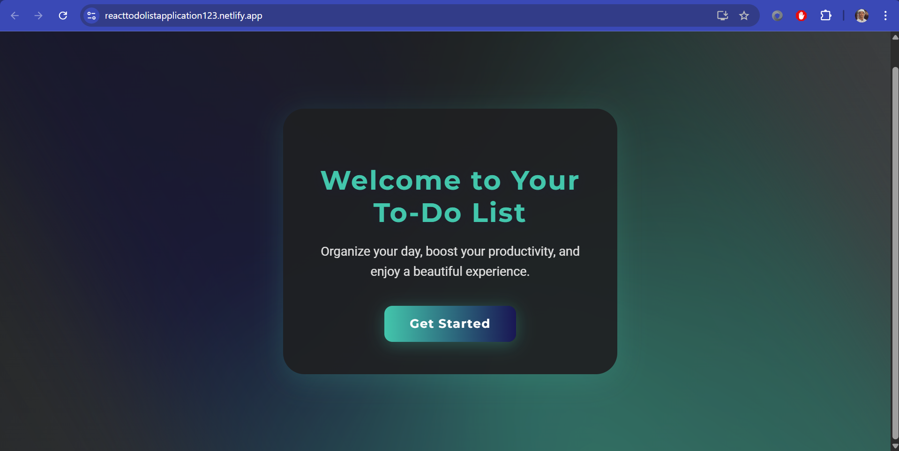
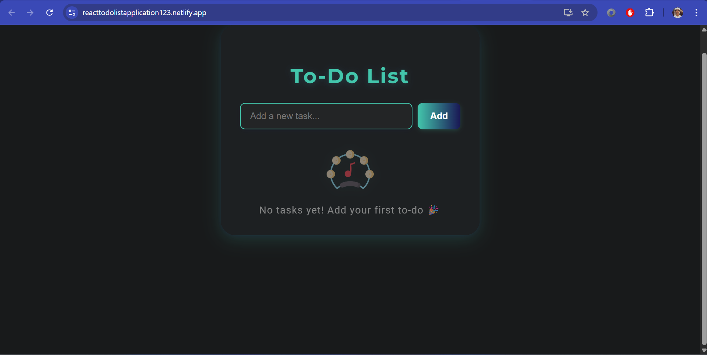
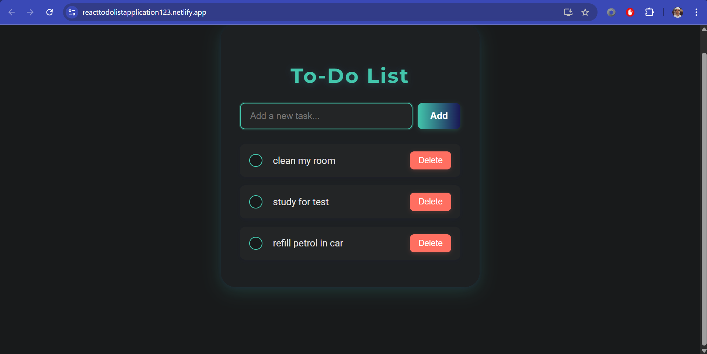
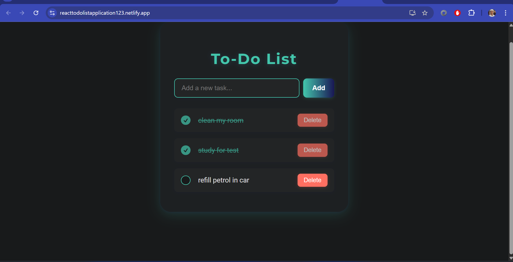

---

# 📝 React To-Do List Application

Welcome to the **React To-Do List Application**, a sleek and responsive web app to help you manage your daily tasks with ease. Featuring a welcoming home page, incredible user interface, and seamless interactions, this app allows you to add tasks, view them, and delete them once you’re done — keeping your productivity on track.

👉 **Live Demo:** [https://reacttodolistapplication123.netlify.app/](https://reacttodolistapplication123.netlify.app/)

---

## 🚀 Features

* 📌 Add tasks you wish to complete
* ✅ Delete tasks after you’ve finished them
* 🎨 Stunning, responsive dark-themed UI
* 🖥️ Single Page Application with smooth routing
* ⚡ Fast and optimized performance
* 👋 Friendly welcome page to greet the user

---

## 🛠️ Tech Stack

**Frontend**

* **React**: Modern JavaScript library for building UIs (functional components, hooks, SPA routing)
* **JavaScript (ES6+)**: Leverages modern JavaScript features
* **CSS**: Custom styling with dark theme, animations, and responsive layout
* **Create React App**: For bootstrapping and building the React app

**Deployment**

* **Netlify**: Hosting and continuous deployment with SPA redirect support
* **Git & GitHub**: Version control and collaboration

**Other Tools**

* **npm**: Manages project dependencies
* **Netlify Redirects** *(optional)*: `_redirects` file to support SPA routing

---

## 📸 Screenshots

| Welcome Page                          | Task View                 | Adding Tasks              | Deleting Tasks            |
| ------------------------------------- | ------------------------- | ------------------------- | ------------------------- |
|  |  |  |  |

---

## 🚀 Getting Started

1. **Clone the repository**

   ```bash
   git clone https://github.com/your-username/your-repo-name.git
   cd your-repo-name
   ```
2. **Install dependencies**

   ```bash
   npm install
   ```
3. **Start the development server**

   ```bash
   npm start
   ```
4. Visit `http://localhost:3000` to view the app locally.

---

## 📦 Deployment

This project is deployed on **Netlify**. You can deploy it yourself by:

* Linking your GitHub repository to Netlify
* Configuring continuous deployment
* Optionally adding a `_redirects` file for SPA routing (to handle 404 redirects)

---

## 🤝 Contributing

Contributions are welcome! Feel free to open issues or submit pull requests to improve the app.

---

## 📄 License

This project is licensed under the MIT License. Feel free to use and modify it as you wish.

---

If you like this project, feel free to ⭐ star the repository and share it! 🚀

---
